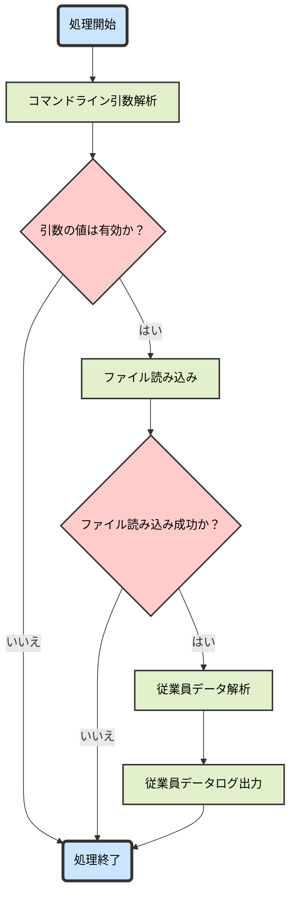
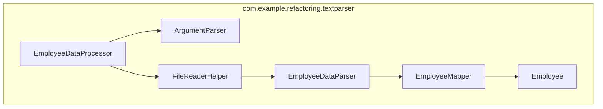
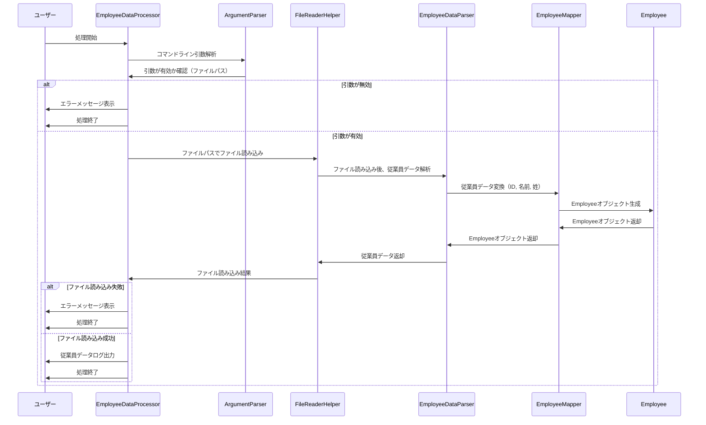

# java-refactor-example

Java コードのリファクタリング学習用リポジトリです
リファクタリング前後のコードをそれぞれ作成し、リファクタリングによるコードの改善点を確認します

# リファクタリングの方針

このプロジェクトではコードの可読性、保守性、拡張性を向上させるために以下のリファクタリング方針を採用しています

## 主なリファクタリング観点

### 1.`SRP（Single Responsibility Principle）原則`に従う

-   単一責任の原則。クラスとメソッドは責務単位に分割し、基本的に 1 つの責務だけを持つようにします
-   これによりコードの可読性、再利用性、テスト容易性を向上させます

### 2.`DRY（Don't Repeat Yourself）原則`に従う

-   コードの重複を避け、一度だけ書くことでメンテナンス性の向上とコードの可読性の向上を図ります
-   これによりコードの可読性、再利用性、保守性を向上させ、バグの発生を減らします

### 3.`Cyclomatic Complexity（サイクロマティック複雑度）`を減らす

-   分岐点（if、case）やループが多い複雑なコードを減らすことでバグの発生率とテスト容易性を向上させます

### 4.`Cognitive Complexity（認知的複雑度）`を減らす

-   条件分岐が深く、ループが多層にネストしているコードを避けることでコードの可読性、直感的理解しやすさを向上させます

### 5. `Stream`と`関数型インターフェース`の活用

-   `Stream`と`関数型インターフェース`を活用し、コードの簡潔さと可読性を向上させデータの操作を直感的に記述できるようにします

### 6. `ラムダ式`と`メソッド参照`の活用

-   ラムダ式やメソッド参照を使用し、コードの簡潔さと可読性を向上させます
-   関数型プログラミングに基づいたスタイルで副作用を減らし、より理解しやすいコードを目指します

### 7. `Optional`の活用

-   `Optional`を使用して、`null`チェックを減らし、安全なコードを書き、認知的複雑度を低減させます

### 8. `try-with-resources`の活用

-   `try-with-resources`を使用して、リソースの自動クローズを確実に行い、リソースリークを防ぎます
-   また、従来の`try-finally`による明示的な close 処理よりもコードの可読性が上がり実装がシンプルになります

### 9. `Lombok`によるボイラープレートコードの削減

-   `Lombok`を使用して、`Getter`、`Setter`、`toString()`などのボイラープレートコードを削減し、コードを簡潔に保ちます

### 10. `Log4j`によるログ出力

-   `System.out.println`の代わりに`Log4j`を使用し、ログレベルの管理と柔軟なログ出力を可能にします
-   ログ出力を一元管理することで、エラーハンドリングやデバッグが容易になります

### 11. `Apache Commons CLI`によるコマンドライン引数の解析

-   コマンドライン引数の解析には`Apache Commons CLI`ライブラリを使用し、可読性、保守性、拡張性を向上させます
-   複雑な引数解析のロジックを簡潔にし、引数の追加や変更を容易にします

# `textparser`パッケージに関して

## `textparser`パッケージが提供する処理

1. コマンドライン引数からテキストファイル（社員リスト）のパスを取得する（例: `your\file\path\SourceText.txt`）<br>
   **テキストファイル形式（例）**:
    ```plaaintext
     99999  test user
     00003  tanaka saburo
     00002  tanaka jiro
     00001  tanaka taro
    ```
2. パスを基にファイルを読み込み、従業員データを解析（パース）する
3. 解析後に従業員データをログ出力する
    ```plaintext
    Employee(id=99999, firstName=USER, lastName=TEST)
    Employee(id=00003, firstName=SABURO, lastName=TANAKA)
    Employee(id=00002, firstName=JIRO, lastName=TANAKA)
    Employee(id=00001, firstName=TARO, lastName=TANAKA)
    ```

## フローチャート図



## コンポーネント図



## シーケンス図



## クラス設計書

### 1. EmployeeDataProcessor

#### 目的

アプリケーションのエントリーポイント。コマンドライン引数を解析し、指定されたファイルから従業員データを処理します

#### 責任

-   コマンドライン引数から処理対象のファイルパスを取得し、従業員データの読み込みとログ出力を行う

#### 主要メソッド

-   `main(final String[] args)`: コマンドライン引数から処理対象のファイルパスを取得する
-   `processEmployeeData(final String filePath)`: ファイルから従業員データを読み込み、ログに出力

#### 依存関係

-   `ArgumentParser`: コマンドライン引数の解析
-   `FileReaderHelper`: ファイルの読み込み

### 2. ArgumentParser

#### 目的

コマンドライン引数を解析し、ファイルパスを取得する

#### 責任

-   コマンドライン引数の解析とファイルパスの取得

#### 主要メソッド

-   `parse(final String[] args)`: コマンドライン引数を解析し、ファイルパスを取得する

#### 依存関係

-   `org.apache.commons.cli`: コマンドライン引数解析のための外部ライブラリ（`CommandLine`, `CommandLineParser`, など）
-   `lombok`: アノテーションを使用してユーティリティクラスとして定義

### 3. FileReaderHelper

#### 目的

指定されたファイルからデータを読み込み、従業員データを処理する

#### 責任

-   指定されたファイルを読み込み、従業員データを取得する

#### 主要メソッド

-   `readFile(final String filePath)`: ファイルを読み込み、従業員データのリストを返す。読み込み失敗時は`Optional.empty()`を返す

#### 依存関係

-   `EmployeeDataParser`: 従業員データの解析
-   `BufferedReader`: ファイルからのデータ読み込み
-   `lombok`: アノテーションを使用してユーティリティクラスとして定義

### 4. EmployeeDataParser

#### 目的

従業員データを解析して、`Employee` オブジェクトに変換する

#### 責任

-   従業員データの解析処理後に従業員データの文字列を`Employee`オブジェクトに変換

#### 主要メソッド

-   `parseEmployees(final BufferedReader employeeDataReader)`: ファイルから読み込んだ従業員データを`Employee`オブジェクトに変換

#### 依存関係

-   `Employee`: 従業員データを保持するクラス
-   `BufferedReader`: ファイルからのデータ読み込み
-   `lombok`: アノテーションを使用してユーティリティクラスとして定義

### 5. EmployeeMapper

#### 目的

文字列配列を Employee オブジェクトに変換するマッパークラス

#### 責任

-   文字列配列（Id, FirstName, LastName）を Employee オブジェクトに変換する

#### 主要メソッド

-   `convertToEmployee(final String[] tokens)`: 文字列配列を`Employee`オブジェクトに変換する

#### 依存関係

-   `Employee`: 従業員データを保持するクラス
-   `lombok`: アノテーションを使用してユーティリティクラスとして定義

### 6. Employee

#### 目的

従業員の情報（従業員 ID、苗字、名前）を保持するデータクラス

#### 責任

-   従業員 ID、苗字、名前の保持

#### 主要メソッド

-   無し

#### 依存関係

-   `lombok`: アノテーションを使用してフィールドに関するメソッドを自動生成

## 使用ライブラリ

-   `org.apache.logging.log4j`: ログ出力
-   `org.apache.commons.cli`: コマンドライン引数の解析
-   `lombok`: コードの簡潔化（Getter、Setter、`toString()`生成など）

## 処理の流れ

### 処理開始:

-   `EmployeeDataProcessor.main()` メソッドが呼ばれ、コマンドライン引数を解析する

### 引数の解析:

-   引数が有効なら、指定されたファイルパスを取得する
-   引数が無効または解析できない場合、エラーメッセージが表示され、処理を終了する

### ファイルの読み込み:

-   `FileReaderHelper.readFile()` メソッドがファイルを読み込み、`EmployeeDataParser.parseEmployees()` メソッドが従業員データを解析する

### ログ出力:

-   従業員データが読み込まれた場合、`EmployeeDataProcessor` クラスが従業員情報をログに出力する
-   読み込みに失敗した場合、エラーログが出力される

## I/O 設計書

### 1. 入力 (Input)

#### 1.1 入力データ形式

アプリケーションはコマンドライン引数として、従業員データを含むファイルのパスを受け取る
このファイルは社員の情報（従業員 ID、苗字、名前）を含んだテキストファイルで、以下の形式で提供される

**テキストファイル形式（例）**:

```plaaintext
99999  test user
00003  tanaka saburo
00002  tanaka jiro
00001  tanaka taro
```

-   各行は`従業員 ID` `苗字` `名前`の 3 つの項目から構成されており、項目間は空白で区切られる
-   従業員 ID は 5 桁の数値文字列（ゼロ埋め）で、苗字と名前は文字列で表現される

#### 1.2 引数

コマンドライン引数として 2 つのパラメータが要求される：

1. `-f` または `--file`: 従業員データを含むファイルのパスを指定するオプション
2. `<filePath>`: 従業員データを含むファイルのパス（例: `your\file\path\SourceText.txt`）

#### 1.3 エラーメッセージ

引数が無効な場合や、ファイル読み込みに失敗した場合は以下のエラーメッセージが表示される

```plaintext
Unrecognized option: -xxxx
Missing argument for option: f
Usage: java EmployeeDataProcessor <file-path>
```

### 2. 出力 (Output)

#### 2.1 出力形式

従業員データが正常に読み込まれた場合、アプリケーションはログに従業員データを出力する

**ログの出力形式（例）**:

```plaintext
Employee(id=99999, firstName=USER, lastName=TEST)
Employee(id=00003, firstName=SABURO, lastName=TANAKA)
Employee(id=00002, firstName=JIRO, lastName=TANAKA)
Employee(id=00001, firstName=TARO, lastName=TANAKA)
```

-   ログは`従業員 ID` `苗字` `名前`を表示する
-   ログ内の`苗字` `名前`は大文字に変換した英数字で表示される
-   インプットファイル内の空行や`{ID}  {苗字} {名前}`形式でない行は無視される

#### 2.2 エラーログ

ファイル読み込みが失敗した場合や引数が無効な場合、エラーログが出力される

**エラーログ（例）**:

```plaintext
Failed to read employee data from file: your\file\path\SourceText.txt
```

# `textparserlegacy`パッケージに関して

`textparser`パッケージの改善前（厳密には、意識して改悪している）コード。処理内容はほぼ同じ

# リファクタリング前後の違い

| **項目**                     | **リファクタリング前のコード**                                                                            | **リファクタリング後のコード**                                                                    |
| ---------------------------- | --------------------------------------------------------------------------------------------------------- | ------------------------------------------------------------------------------------------------- |
| **責務**                     | メインクラスがコマンドライン引数解析、ファイル読み込み、従業員データ解析など複数の責務を持っている        | 責務を各クラスに分割し、可読性と保守性を向上                                                      |
| **コードの再利用性**         | 再利用性が低く、DRY 原則に違反する可能性が高い                                                            | 単一責務を持つクラス設計により再利用性が向上し、DRY 原則に違反する可能性が低くなっている          |
| **変更への対応**             | 変更に弱く、複数の箇所に手を加える必要がある                                                              | 柔軟に変更に対応可能（コマンドライン引数の数の変更や従業員データのフォーマット変更に強い）        |
| **簡潔さと可読性**           | Stream API やラムダ式、関数型インターフェースなどの機能を活用していないため、コードの簡潔さと可読性が低い | Stream API やラムダ式、関数型インターフェース、メソッド参照を活用し、コードの簡潔さと可読性が向上 |
| **ボイラープレートコード**   | `EmployeeLegacy` クラスで `Getter` と `toString()` を自前で実装しており、ボイラープレートコードが多い     | `Employee` クラスで `Lombok` のアノテーションを使用して自動生成し、ボイラープレートコードを削減   |
| **認知的複雑度**             | `procEmpData` メソッドが多くの責任を持ち、複雑で理解しづらい                                              | 責任を小さなメソッドやクラスに分割し、ネストを無くすことでコードが簡潔で理解しやすくなった        |
| **サイクロマティック複雑度** | `procEmpData` メソッドには複数の制御構造があり、サイクロマティック複雑度が高い                            | コードの制御フローが簡素化され、テストや理解がしやすくなった                                      |
| **エラーハンドリング**       | エラーハンドリングが複数の場所に分散しており、冗長でエラー処理が難しい                                    | エラーハンドリングが簡素化され、`try-with-resources` によってリソース管理が自動化された           |
| **ファイル処理**             | ファイルの読み込みと処理が `procEmpData` メソッドに含まれており、関心の分離がなされていない               | ファイル処理を別のメソッド (`readFile`) に分け、責任が明確になった                                |
| **リソース管理**             | リソース管理は手動で `finally` ブロックで行われており、エラーが発生しやすい                               | `try-with-resources` を使用してリソースの管理が簡素化され、エラーが減少した                       |
| **コードの長さ**             | `procEmpData` メソッドが長く、保守が難しい                                                                | コードが小さなメソッドに分割され、各メソッドが短く、理解しやすくなった                            |
| **テスト容易性**             | 1 つの大きなメソッドが複数の責任を持ち、テストが難しい                                                    | モジュール化された設計により、テストが容易になった                                                |
| **拡張性**                   | 新しい機能を追加する際、コード全体に手を加える必要があり、拡張性が低い                                    | コードがモジュール化され、機能を簡単に拡張できるようになった                                      |
| **可読性**                   | 長いメソッドと複雑な責任のため、可読性が低い                                                              | 小さなメソッドに分割され、コードが読みやすくなった                                                |
| **保守性**                   | 複数の責任を 1 つのメソッドに持たせているため、保守が難しい                                               | 各メソッド・クラスが単一の責任を持つため、保守が容易になった                                      |
